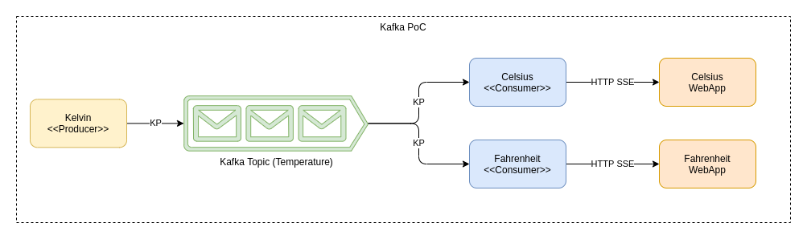
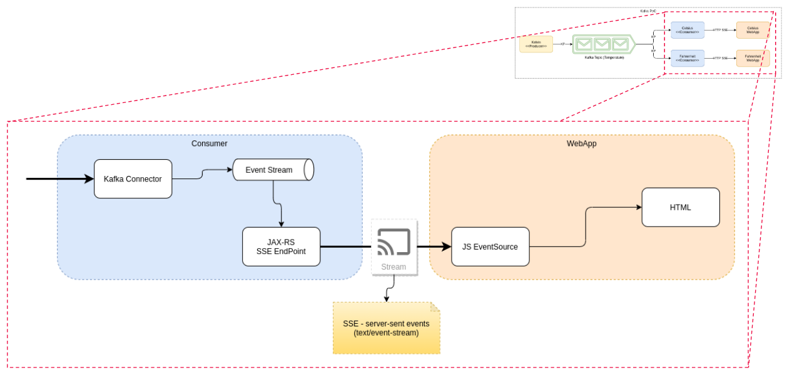

# kafka-node-js

An example of Kafka with [Node.js](https://nodejs.org) as producer, [Node.js](https://quarkus.io) as consumers SSE streaming to EventSource JavaScript

**This example was based in this [project](https://github.com/higorrg/kafka-quarkus-js)**

## Architecture

The ideia is to publish Kelvin temperatures in the "temperature" Kafka Topic, then start two instances of the consumer project one to consume and convert from Kelvin to Celsius and the other to consume and convert from Kelvin to Fahrenheit.

After running the scripts described below, two Web Apps will be available one at http://localhost:8092/ and the other at http://localhost:8093/

The consumer app is configured in application.properties where the name of the temperature and the formula to convert from Kelvin are set.

There is an internal stream of Kelvin values inside the consumer app published in an JAX-RS endpoint as SSE - Server-Sent (text/event-stream).

Finally the consumer app contains a Web App made with Bootstrap, JQuery and vanila EventSource Java Script to consume from a SSE endpoint and print in HTML.





## Environment Requirements

This example requires [Docker](https://docs.docker.com/get-docker/) and [Docker Compose](https://docs.docker.com/compose/) pre-installed.

## Kafka

### Start Kafka

Initialize the Kafka stack by running this command

```bash
./start-kafka.sh
```

### Create Temperatura Topic

Create the temperature topic by running this command

```bash
./create-temperature.sh
```

### Stop Kafka

Terminate the Kafka stack by running this command

```bash
./stop-kafka.sh
```

## Kafka (Other scripts for testing)

### List All Topics

List all topics by running this command

```bash
./get-topics.sh
```

### Write Values on Temperature Topic

Write values in temperature topic by running this command

```bash
./set-temperature.sh
```

### Read Values on Temperature Topic

Read values in temperature topic by running this command

```bash
./get-temperature.sh
```

## Running The Producer

Start the producer by running this command

```bash
kafka-node-producer/kelvin.sh
```

## Running The Consumers

Start the consumers by running these commands

```bash
kafka-node-consumer/celsius.sh
kafka-node-consumer/fahrenheit.sh
```

[Access Consumer in Celsius](http://localhost:8092/)

[Access Consumer in Fahrenheit](http://localhost:8093/)
